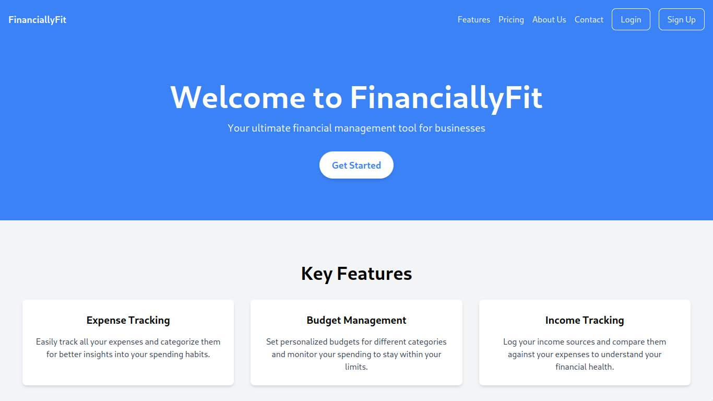
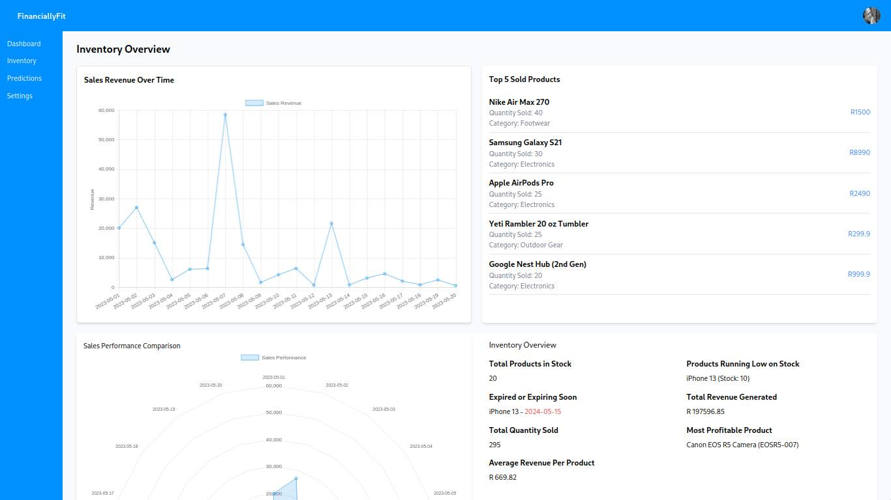
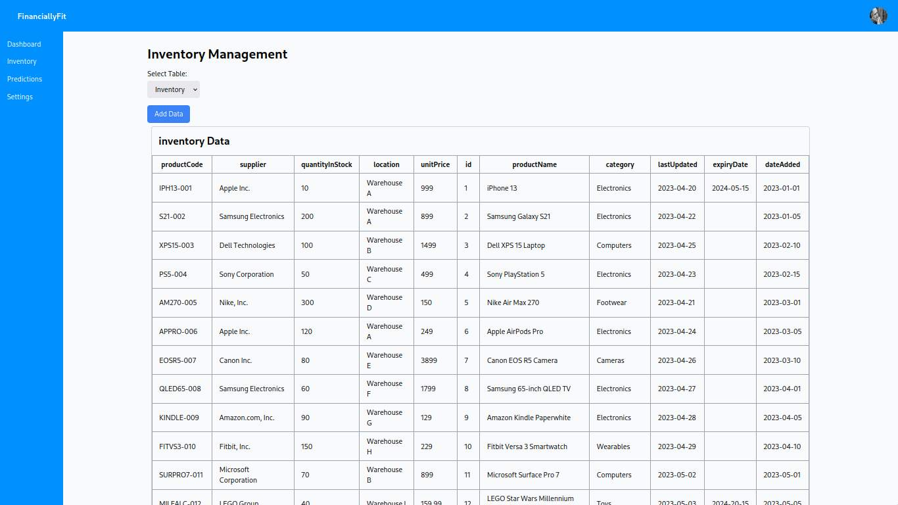

# FinanciallyFit

Welcome to FinanciallyFit, your ultimate financial management tool for businesses. FinanciallyFit is designed to help you track expenses, manage budgets, and log your income with ease. Built with React and Tailwind, this application provides a seamless and user-friendly experience.

## Website

website link: [FinanciallyFit](https://financially-fit.vercel.app)

## Key Features

- **Expense Tracking**: Easily track all your expenses and categorize them for better insights into your spending habits.
- **Budget Management**: Set personalized budgets for different categories and monitor your spending to stay within your limits.
- **Income Tracking**: Log your income sources and compare them against your expenses to understand your financial health.

## How It Works

1. **Sign Up**: Create your FinanciallyFit account in minutes and get started.
2. **Import Your Inventory**: Import your Excel spreadsheet into the inventory for seamless tracking.
3. **Dashboard Summary**: View a summary of your previous performance on the dashboard.
4. **Prediction Insights**: The prediction page provides insights on items to focus on, which items to buy more of, and how much to buy.

## Screenshots

_HOME Page_

_Dashboard_

_Inventory Page_

Example Data CSV files :

- [Inventory Data CSV](<public/repo/FinanciallyFit%20(InventoryData).csv>)
- [Sales Data CSV](<public/repo/FinanciallyFitSalesData).csv>)

## Benefits

- **Save Time**: Simplify your financial management process and save valuable time.
- **Improve Financial Health**: Gain insights into your spending habits and make informed financial decisions.
- **Stay Organized**: Organize your expenses and budgets in one place for better financial organization.

## About

FinanciallyFit was created to help you manage your finances and get rich with the power of machine learning. Our team is dedicated to providing the best tools to help you make informed financial decisions, improve your financial health, and achieve your financial goals. By leveraging advanced machine learning algorithms, we offer insights and predictions that empower you to optimize your spending, budgeting, and income management.
